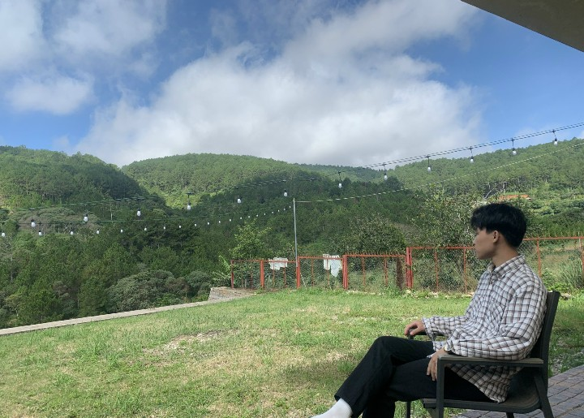

# Hi, I'm Duc Manh 👋

🎓 IT Student  
💻 Interested in Web, Mobile & AI  
🚀 Focused on building practical applications and improving problem-solving skills

## Tech Stack
- Frontend: React, Vue, HTML, CSS, JavaScript
- Backend: Node.js, Express
- Mobile: React Native (Expo)
- Database: MongoDB, SQLite
- Tools: Git, REST API

## Current Learning
- Full-stack Web Development
- Mobile App Development
- Applying AI in real-world projects

## Skills

<!--
**manh24/manh24** is a ✨ _special_ ✨ repository because its `README.md` (this file) appears on your GitHub profile.

Here are some ideas to get you started:

- 🔭 I’m currently working on ...
- 🌱 I’m currently learning ...
- 👯 I’m looking to collaborate on ...
- 🤔 I’m looking for help with ...
- 💬 Ask me about ...
- 📫 How to reach me: ...
- 😄 Pronouns: ...
- ⚡ Fun fact: ...
-->
